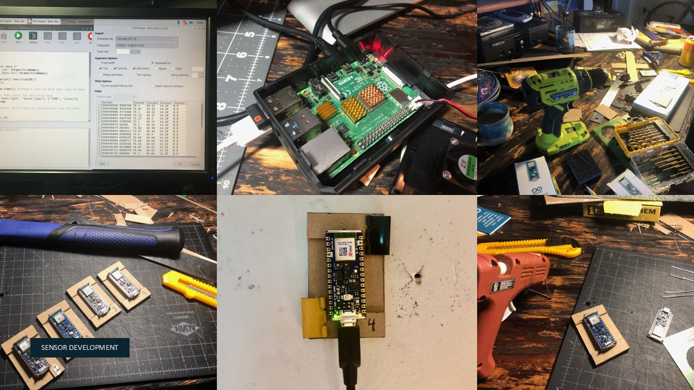
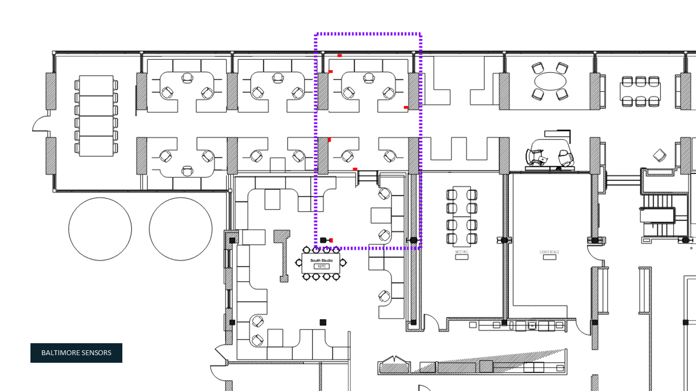
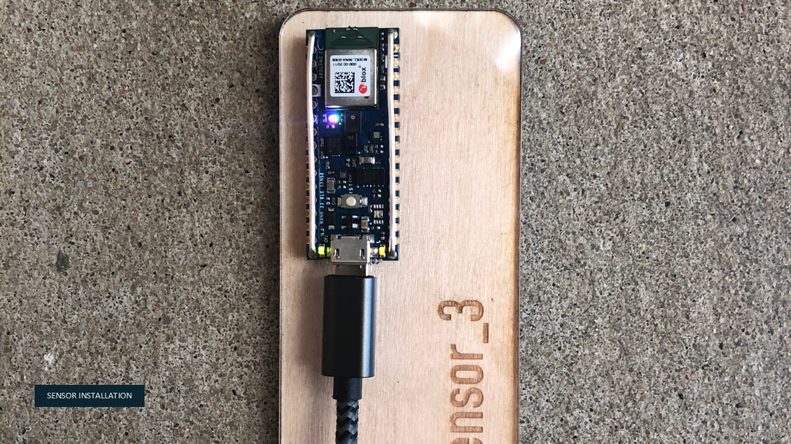
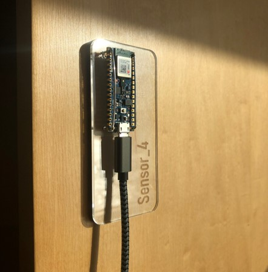
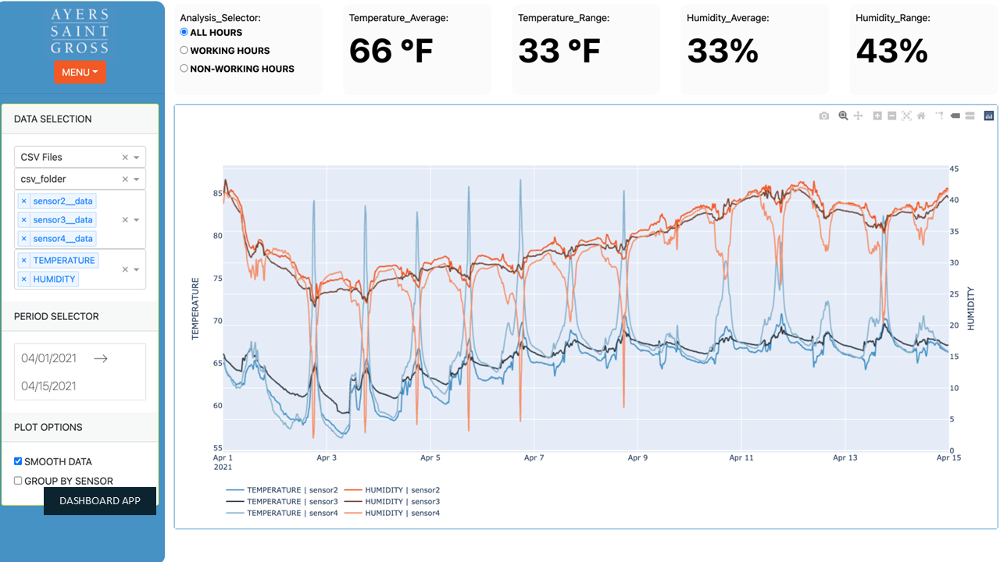

# Sensors + Occupant Comfort Evaluation

## Primary Contact:
Chris Hazel

## Additional Developers

## Problem Statement
We need to establish a feedback loop of real data in order to understand how people use and feel within our buildings to make sure that we are designing with occupant comfort in mind and that the reality matches our analysis throughout design.  

## Thesis
Develop a mix of quantitative (environmental sensors) and qualitative (occupant surveys) methods for understanding occupant comfort within our buildings and spaces. 

## Summary
Throughout 2020, Chris Hazel developed a data pipeline to measure, store and analyze/visualize environmental data using primarily off the shelf Arduino micor-controllers and a Raspberry Pi comupter to work as a hub. 

## Tech Specs
- Arduino BLE Sense microcontroller (off-the-shelf board with integrated sensors) - *the Arduino sensors collect the environment data*
    - Temperature
    - Humidity
    - Light
    - Sound
    - Air Pressure

- Raspberry Pi 3 - *the raspberry pi is a hub to collect data from multiple sensors, data is then compiled on device then periodically transferred to the cloud database*

- AWS Cloud database - *a mySQL database was established on our internal AWS server to hold all of the sensors data*

- Plotly Dash App - *a Dash dashboard app was developed to view and analyze the live sensor data*

## Process Images

## Next steps
- 

## Links

## Conclusion