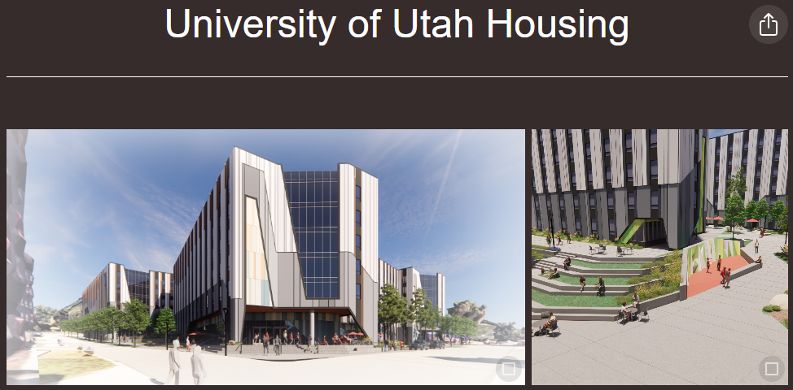

## Problem Statement
There is not a simple, professional, easy-to-use, and easy-to-access, method for sharing, and managing project assets.

## Thesis
Create a web app that allows for the easy creation of custom, shareable mircosites that can host and present a variety of project assets and information.

## Summary
To explore the thesis, a prototype Node.js /React web-app was created that can host and present images, folders, video, models, text, and iFrames in an easy to customize grid layout. The prototype is hosted at *.asg-designs.com where the * can be any short identifier for a project or site. 

Features:
- Drag and drop file uploads.
- Folders allow for deeply nested hierarchies.
- 3D model viewer that supports loading in Augmented Reality for intuitive interaction.

Repo:
- [GitHub Repository](https://github.com/miketalbott/talbott-portfolio)

## Application
- [Brown University ISLB Proposal](https://asg-quicksite-app.onrender.com/#brown/)
- [Forma Examples](https://asg-quicksite-app.onrender.com/#forma/)
- [Fort Wayne Proposal](https://asg-quicksite-app.onrender.com/#fortwayne/)
- [Rice University Proposal](https://asg-quicksite-app.onrender.com/#rice/)
- [Discovery Point](https://asg-quicksite-app.onrender.com/#terrapin/)
- [UMB Grad Housing Study](https://asg-quicksite-app.onrender.com/#umb/)
- [UT Austin Grad Housing Proposal](https://asg-quicksite-app.onrender.com/#ut/)
- [Univ. of Utah - Student Housing - Phase 1](https://asg-quicksite-app.onrender.com/#utah/)

## Conclusion
The site succeeds in providing a easy-to-create, easy-to-access site for sharing project assets. 

## Next Steps
- Move hosting and storage to asg AWS services and ayerssaintgross.com domain.
- Integrate with ASG data to connect to vantagepoint for project info and openasset for image storage and processing.
- Add security and authorization so we can control who can view, edit, and share these sites.
- Work with Graphics and Marketing to develop and improve the visual style and layout to fit with brand guides.
- Add features for linking, and presentation mode. Add support for more formats like PDFs and PPTs.
- Fix bugs.

