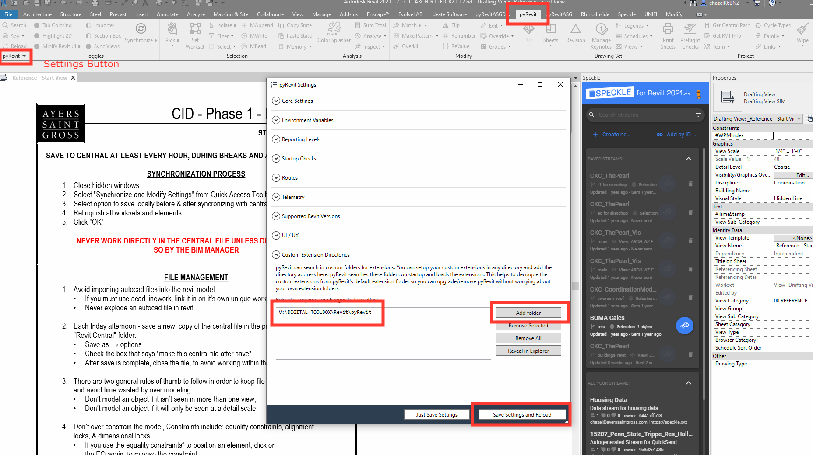

## Primary Contact:
Chris Hazel

## Additional Developers
Noah Harburger

## Problem Statement
We perform too many tedious and repeative tasks in Revit that can consume a large amount of time.

## Thesis
By creating a collection of lightweight automation scripts, we can reduce the time spent on these laborious tasks.

## Summary
We created a collection of pyRevit Scripts that can be automatically loaded into Revit for use by the whole firm.

## Installation
Install the base pyRevit plugin on your computer for all versions of Revit. This can be done without an admin password. 

[Link to pyRevit GitHub](https://github.com/pyrevitlabs/pyRevit/releases/tag/v4.8.16.24121%2B2117)

### To install the custom ASG toolset:

- Open the pyRevit tab
- Select the pyRevit dropdown to the far left on the ribbon
- Select the "Settings" button which will open up this dialog box
- Select "Add Folder" and navigate to this directory, " V:\DIGITAL TOOLBOX\Revit\pyRevit"
- Select "Save Settings and Reload"

Then you should get an extra tab named pyRevitASG with all of the buttons. You will never have to do these steps again; anytime I update a script on the network, it will automatically update in your ribbon next time you open Revit or reload pyRevit.

## Application
### Graphic Scales
- **Add Graphic Scale** : Add a dynamic graphic scale to your project and all applicable views on selected sheets. 
- **Set View Scale Value** :  Automagically sets the scale for all associated graphic scales in your project.
---
### Hide/Unhide Annotations
- **Add to Hide List** : Add an annotation family type to a list of elements that can be hidden/unhidden across the project. This list is sharable across all project team members. 
- **Hide Elements** : Hide selected families from the list of hide elements.
- **Unhide Elements** : Unhide all recently hidden elements. 
---
### Housing Tools
- **Capture Data As Text** : Write a text note on the active view to sum and count selected filled region and detail item elements visible in the view. 
- **Area Counter** : Create a static bar chart of the total area of selected filled regions and detail items visible in the active view. 
- **Unit Counter** : Create a static bar chart of the total count of the selected filled regions and detail items visible in the active view. 
---
- **Add View to Sheet** : Add the active view to any sheet within the project (much easier than trying to manually find a view in the project browser)
- **Function Request** : Request a function or report a bug. 
- **Renumber Views** : Renumber all views on a set of sheets to align with the ASG titleblock grid. 
- **spyRevit** : Dynamic function lookup in Revit (kind of like AutoCAD + Rhino).
- **Cubify-Mega** : Create a set of generic family elements (size and parameters) based on .csv file input.
- **Create Enlarged RCP** : Create live enlarged RCP views that follow the boundary of selected enlarged plan views. 
- **Wall Fixer** : Will set all *null-value* wall parameters (acoustic rating, fire rating, smoke rating) to "No" or 0--this will help to clean up those partition schedules. 

## Next Steps:
New development of pyRevit buttons is on as-needed basis. 

**Planned Updates**:
- [] Room Exporter: Export all room geometry and important parameter data as a geoJSON file for cataloging space data

## Links

- [Post on the Square](https://thesquare.ayerssaintgross.com/_layouts/15/Updates/ViewPost.aspx?ItemID=36145)

## Conclusion
Use pyRevit, pardner

