## Problem Statement
Facade designs can often be defines by a small set of rules and variables. However, we often internalize these rules and use a "brute-force" approach to designing and documenting our facades. This results in a ton of time spent in tedious production and leads to an in-flexible products that can be costly to adapt to changes.

## Thesis
To avoid in-flexible and tedious facade production, we should define our designs through a set of rules and parameters to allow for easy modification and adaptation to changes in requirements or preference. Furthermore, parametric models can automate the modelling process that would otherwise be tedious, time-consuming, and unforgiving to change.

## Application
The University of Utah P3 Housing Project was looking for an innovative and unique facade design that would draw inspiration from the two student activities that the building would serve: Mountaineering/Climbing and VideoGames/E-Sports. The design began with a discussion of the dicotomy between the digital and the physical and how we could combine the elegances of digital abstraction with the beauty of the surrounding mountain landscapes.

## Design Inspiration
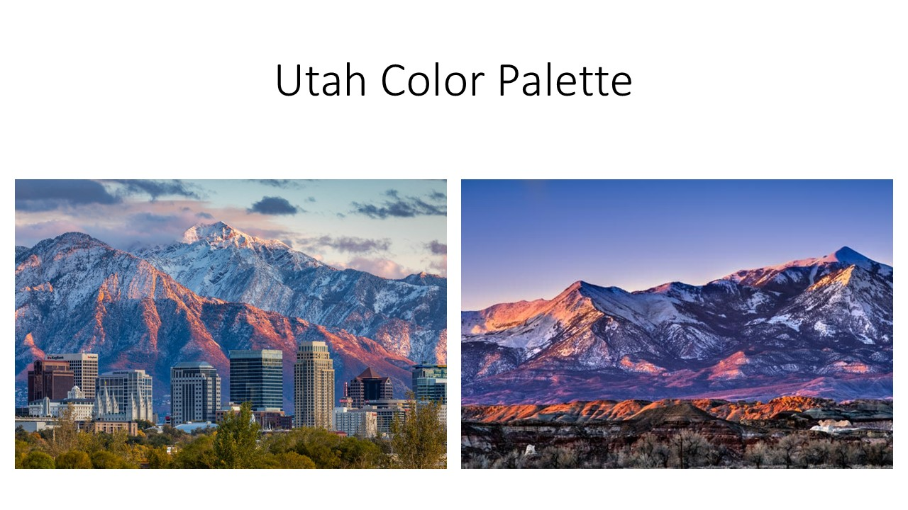
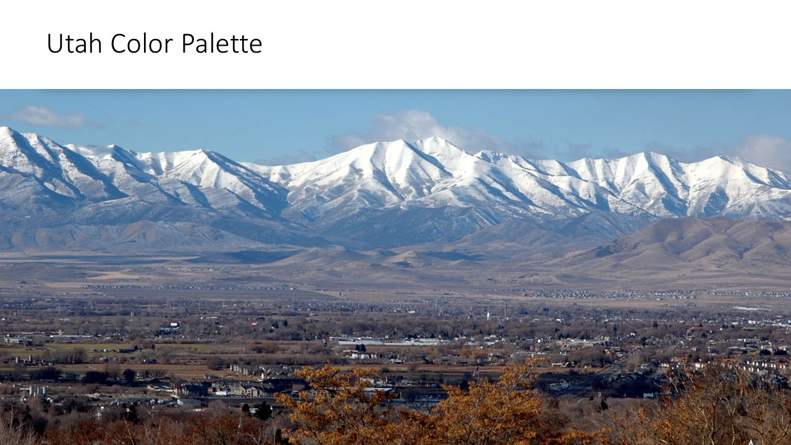
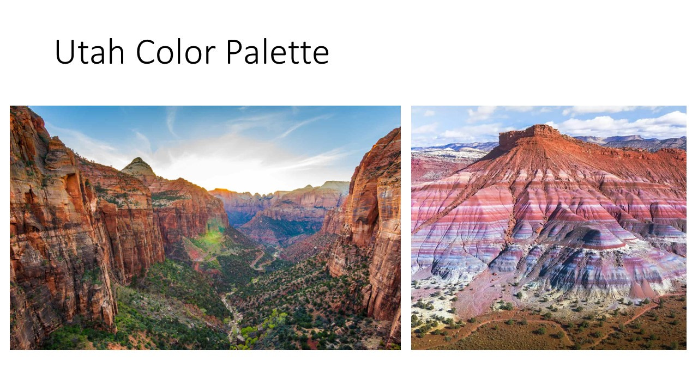
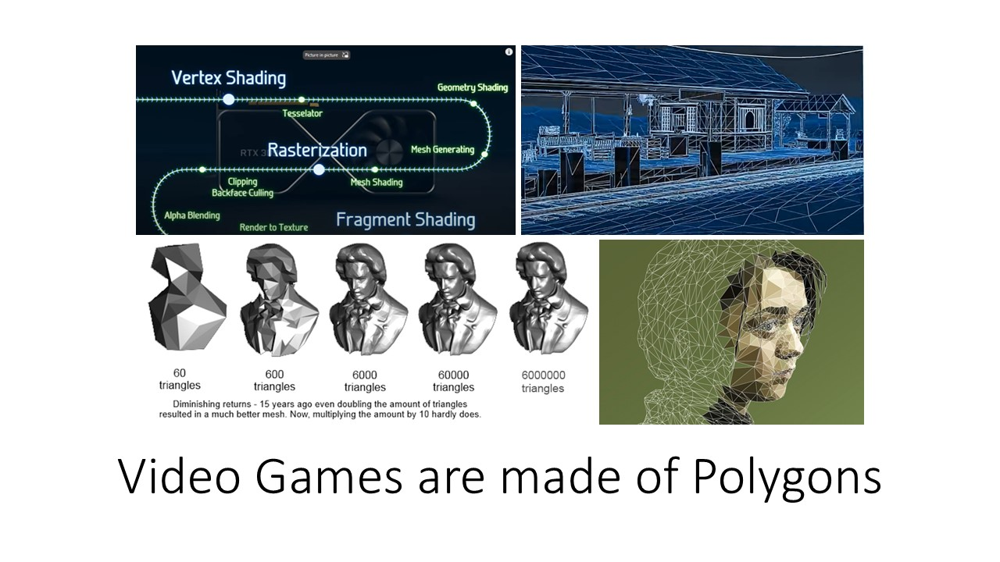
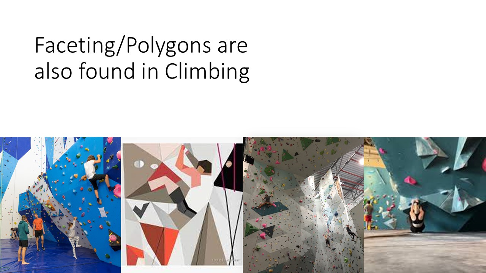
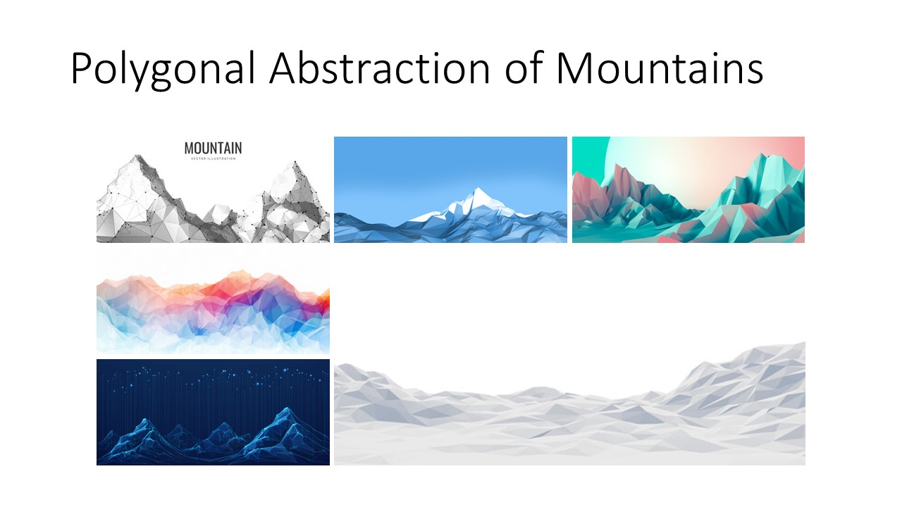
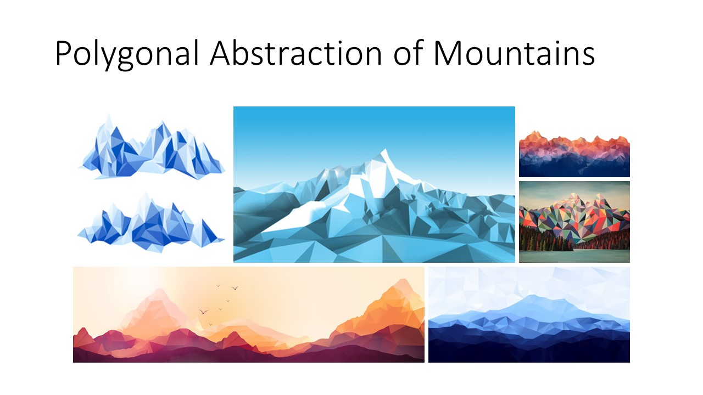

## Early Studies
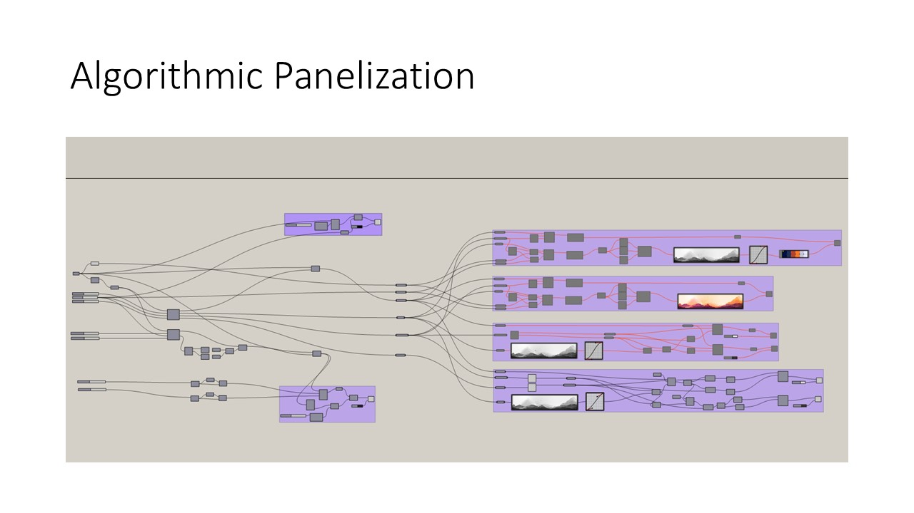
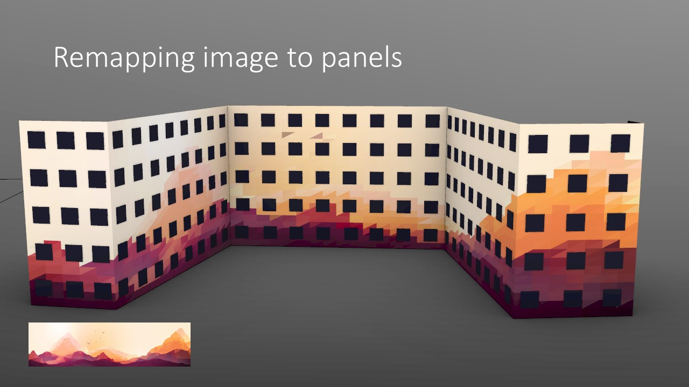
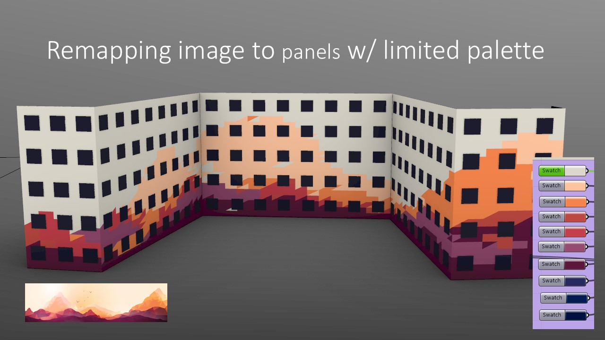
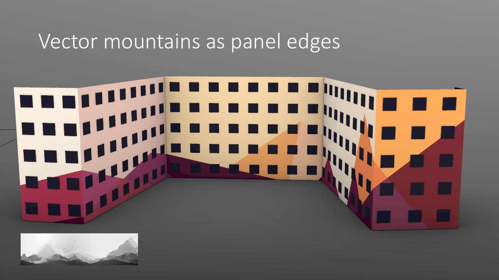
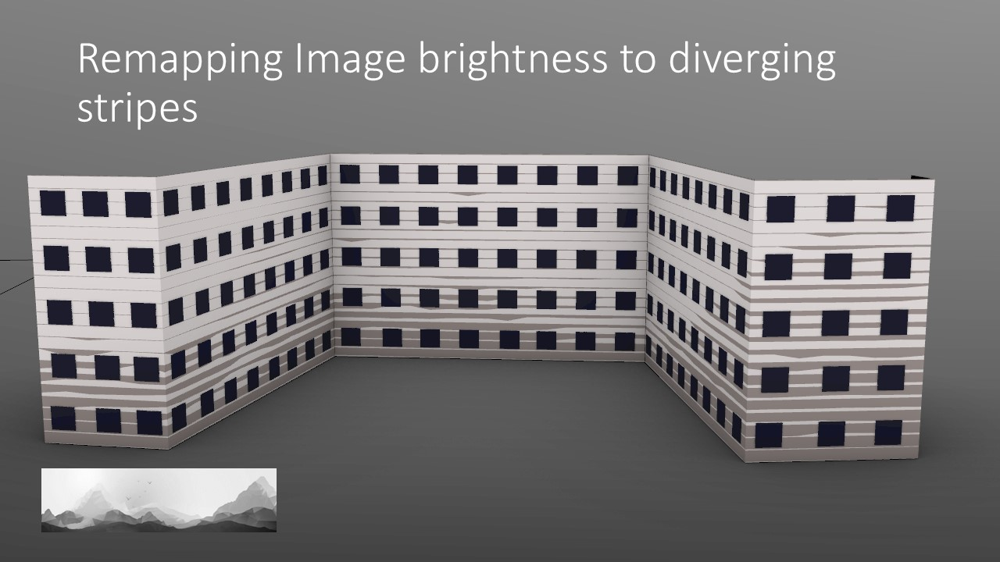
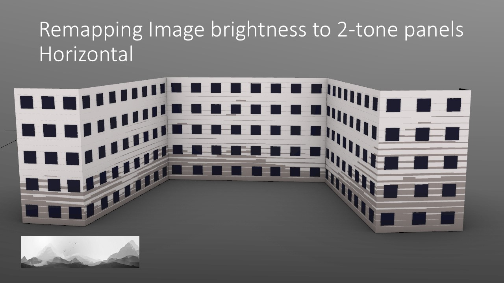
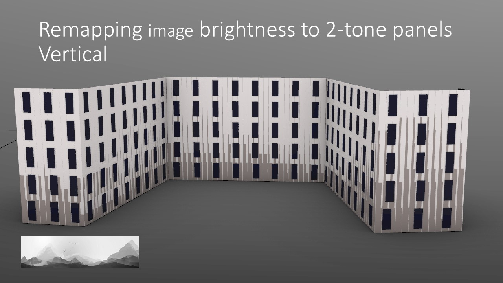

## Final Design

[Link to PowerPoint - Facade Study](assets/03.0-Parametric-Design-Tools/20240104_Utah_FacadeStudy_v1.pptx)

## Conclusion
Parametric Design is an intelligent way to be adaptable and ready for change. The up-front cost can be greater, and the expertise required can be high. This can reduce the ROI and the accessibility for the average project. The pros and cons should be weighed for each project along with any future value beyond a specific project.

### Lessons Learned
1. The time spent learning how to work in Grasshopper with a complex data structure. There was a ton of time devoted to learning that is hard to justify as a project expense. ...but the second time is always faster, and the third even more.
2. Once the parametric model was complete and we needed to move everything to Revit, the workflow because very cumbersome and in-flexible (exactly what we were trying to avoid). In the future we should figure out more flexible and maintainable ways to get from grasshopper etc. to revit for documentation.

### Next Steps
- Evaluate alternative parametric design tools like:
    - Railclone(3dsMax)
    - GeometryNodes(Blender)
    - Flow (Giraffe)
    - Test-fit
    - Dynamo(Revit)
    - City Engine (CGA / VCGA)

- Create a design spec for an idealized parametric design tool.