## What is Autodesk Forma?

According to Autodesk:
> Autodesk Forma (formerly Spacemaker) helps planning and design teams deliver projects digitally from day one. Use conceptual design capabilities, predictive analytics, and automations to make solid, sustainable, foundations for your projects.
>- Unlock efficiencies with intuitive project setup, design automations, and fluid connectivity with Revit
>- Use data-driven insights in real-time to make fast, smart design decisions that reduce risk and improve business and sustainability outcomes
>- Improve collaboration and secure buy-in by using data and visuals to tell a compelling design story that can help you win more bids

According to Me:
> Brower-based, early-stage, concept design and project planning tool.
>- Free **context model** linked to partnered data providers.
>- Simple and intuitive **modeling tools**.
>- Real-time **area metrics**.
>- One-click **sustainability analysis** tools.
>- The power of the “**Cloud**”.

What its not:
>- It's not "Newforma"
>- It's not Autodesk "FormIt"
>- It's not a SketchUp or Rhino replace
>- It's not going to give you the answer

# How can we use it?
[Link to Web App](https://app.autodeskforma.com/)

## New Project
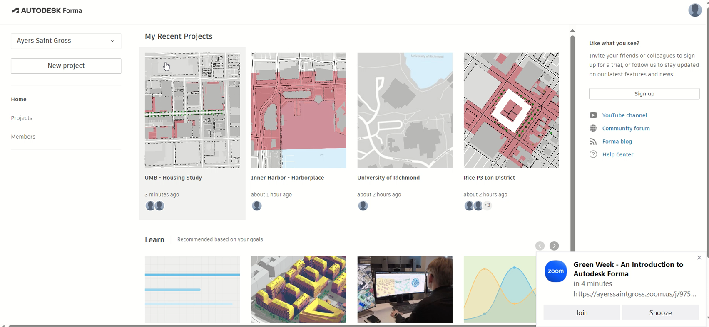
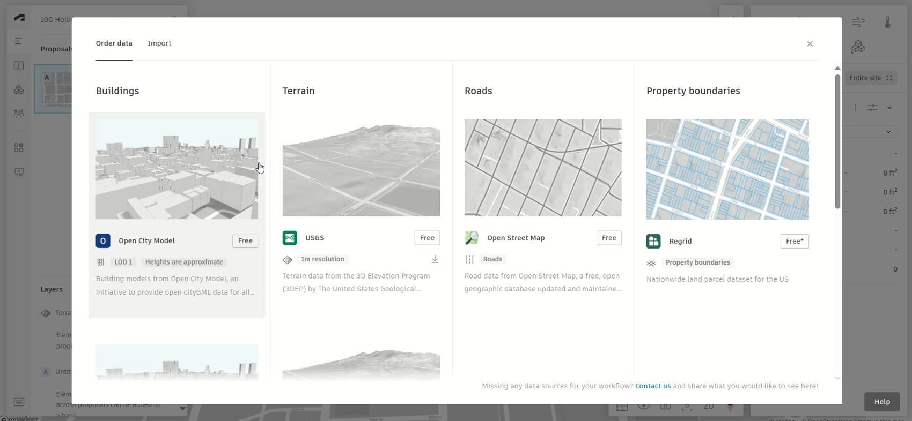

## Context Model
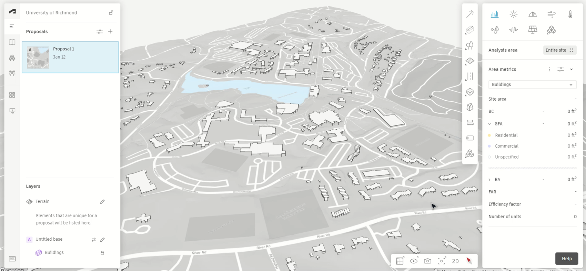

## Concept Model
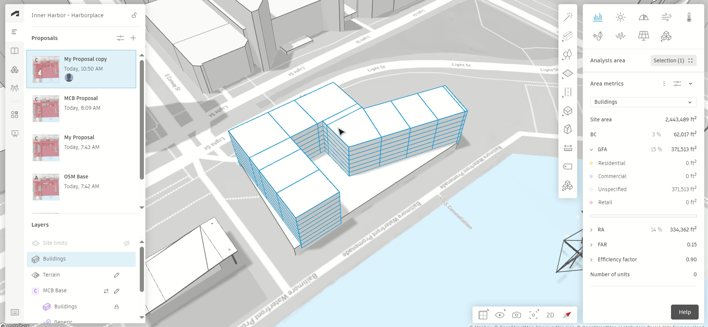
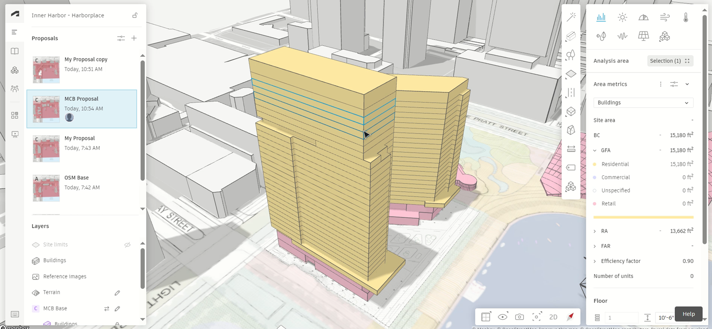

## Area Metrics
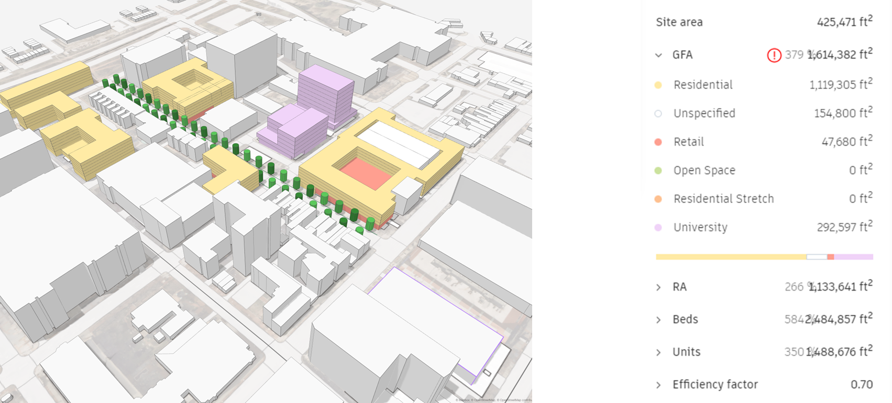
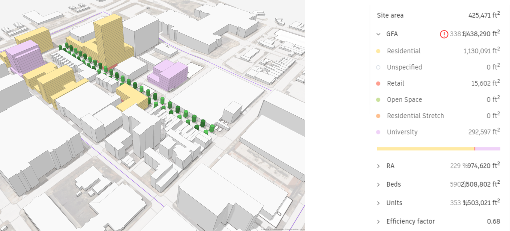

## Sun Hours
Calculates how many hours of sunlight your site will get on specific dates.
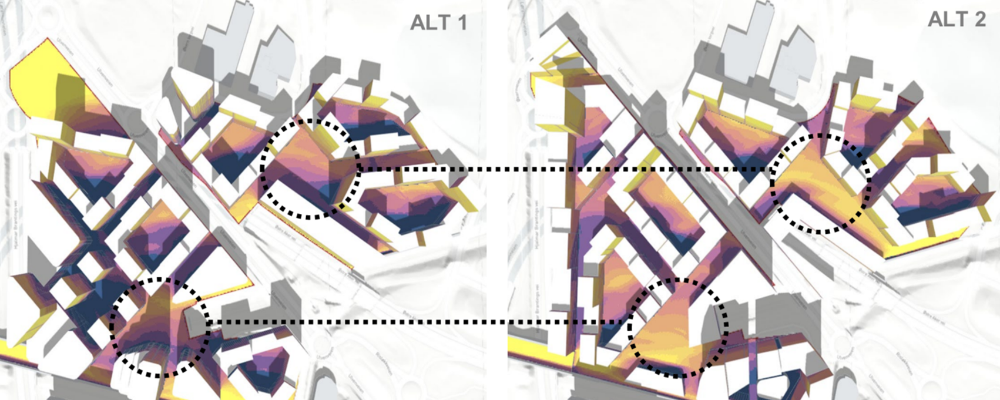
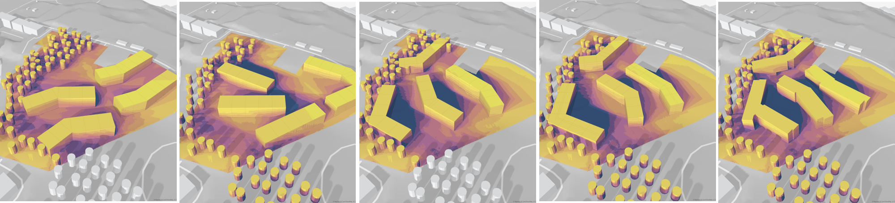
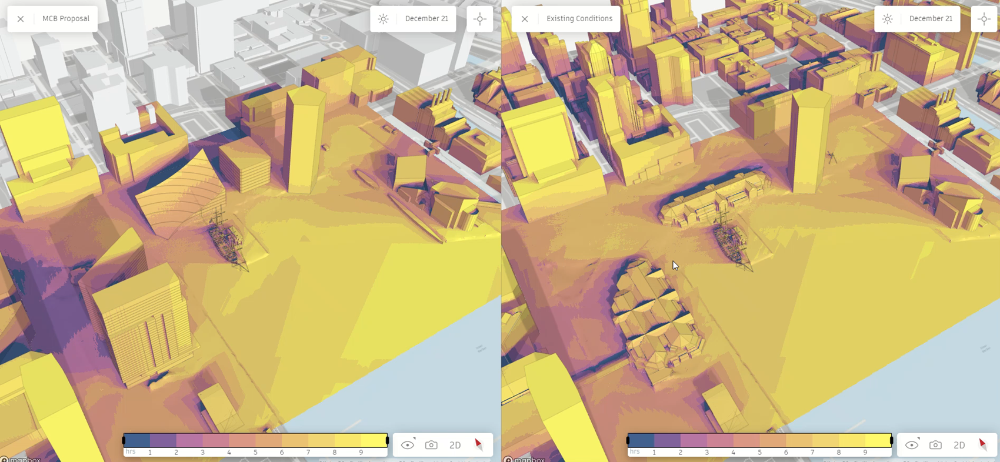
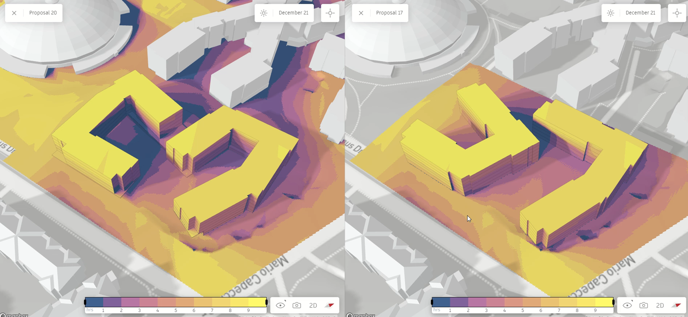

## Daylight Potential
Identifies surfaces with little access to daylight using a Vertical Sky Component score.
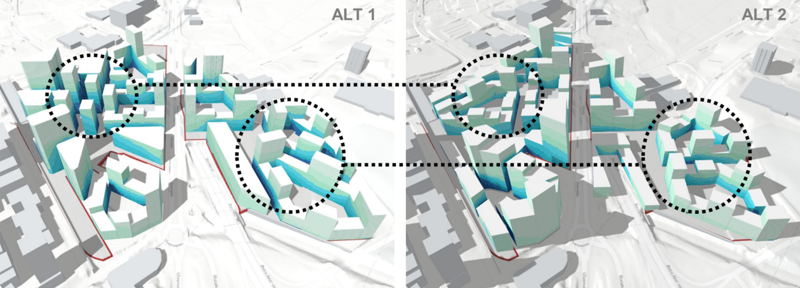
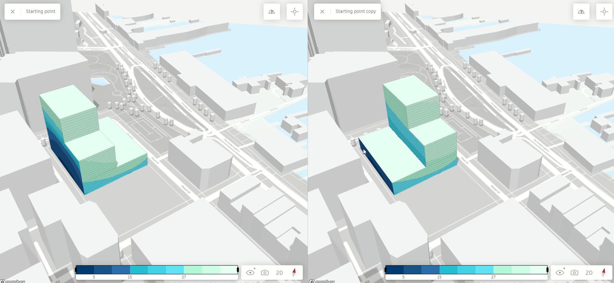

## Wind
Predicts wind conditions based on thousands of simulations. Detailed analysis takes time.
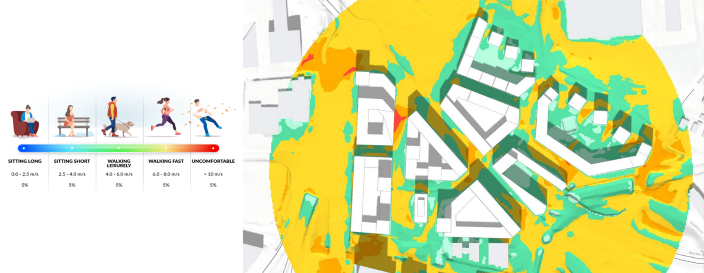
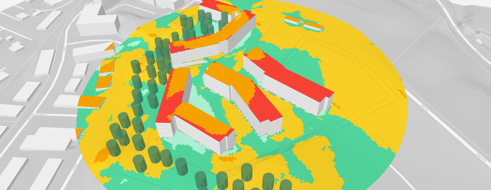
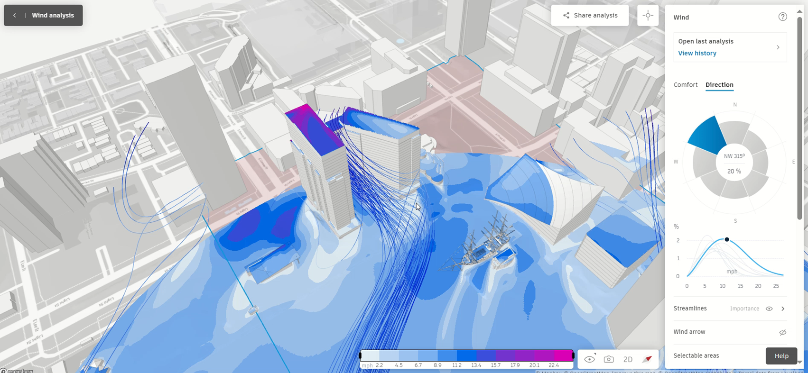

## Microclimates
Calculates perceived temperature. Based on sun, wind, sky exposure, and climate type.
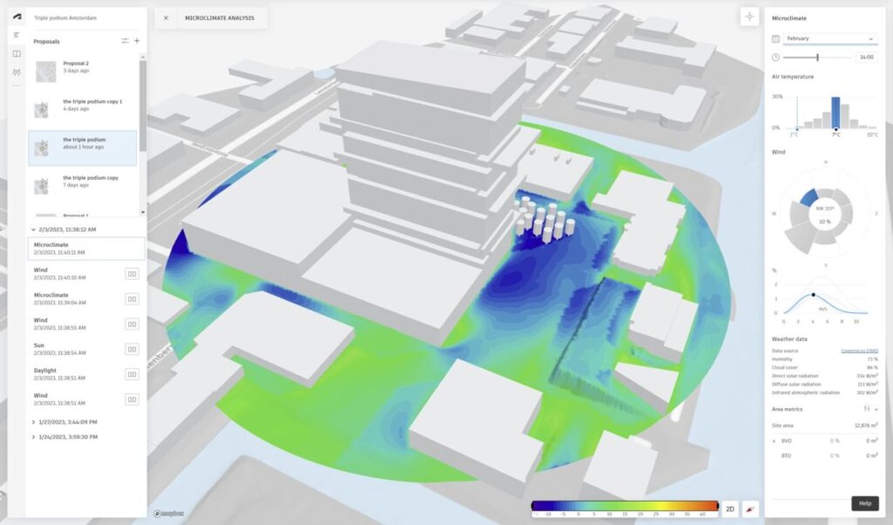
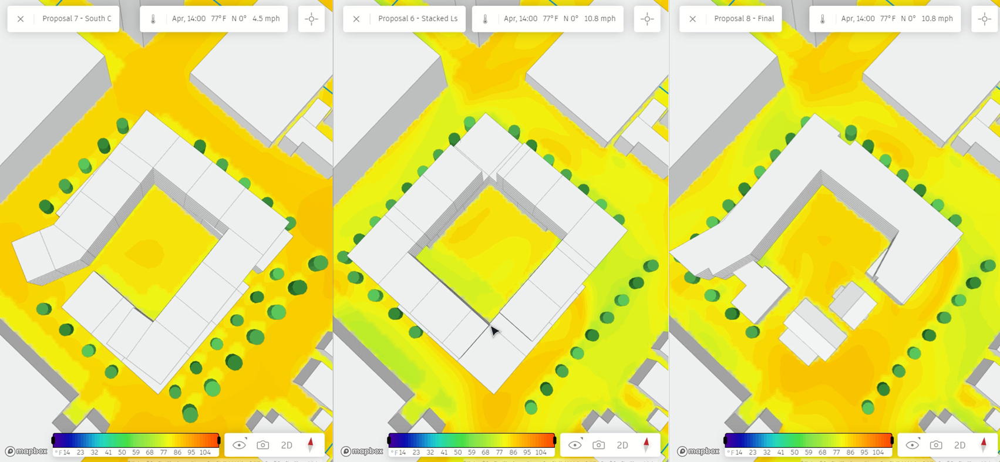

## Operational & Embodied Energy
Real time predictions of operational energy intensity.
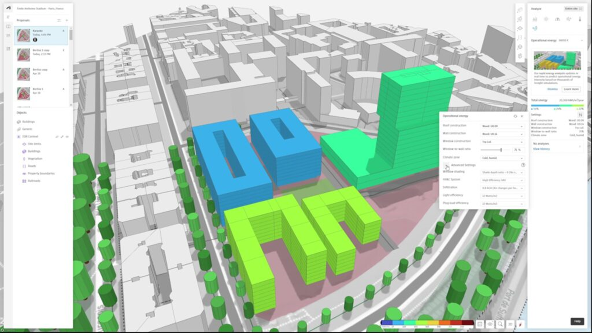

## Extensions
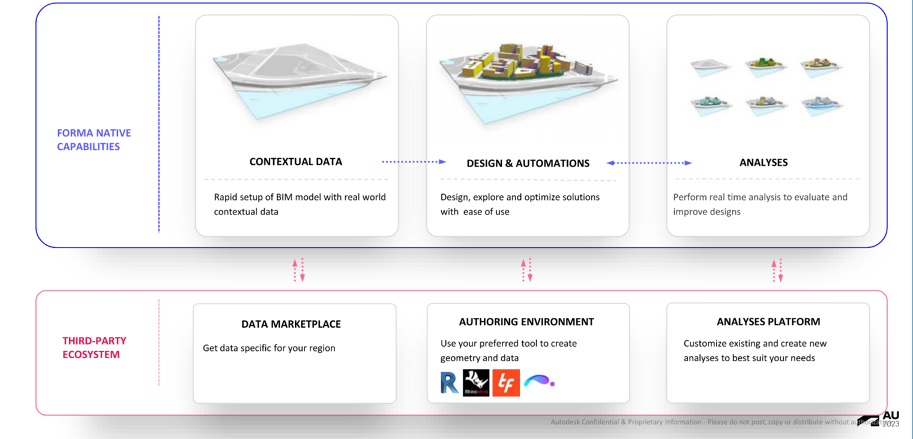

# Why should we care?
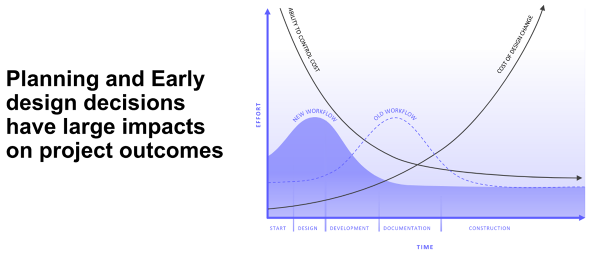
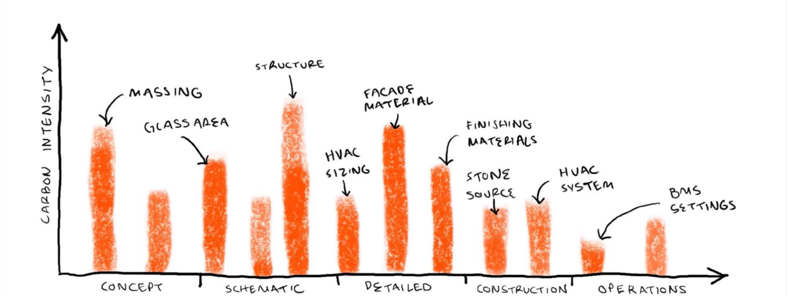

# Conclusions

## Strengths
- Good tool for “rough” conceptual design.
- Quick area calcs for site capacity.
- Simple sustainability visuals: Seeing is believing.
- Real-time feedback can inform design.
- In active development with weekly new features.
- Free with our current Autodesk licenses

## Weaknesses
- Incomplete, Buggy, and Constrained.
- Simplicity limits possibilities.
- Embodied Carbon feature is new and needs work.
- Not great visuals outside of analysis tools.
- No DWG or Vector export.
- Just more lock-in to the Autodesk Empire

## Alternatives
Campus Planning and Urban Design
- ArcGIS Urban, City Engine, or Giraffe

Feasibility Studies
- TestFit, Giraffe, Digital Blue Foam, 

Concept Design
- Snaptrude, Arcol, Sketchup, Rhino.

## Link to Presentation
[Forma Presentation - Green Week 2024](https://asgarchitects-my.sharepoint.com/:p:/g/personal/mtalbott_ayerssaintgross_com/EZAav6wmxF5MsnZal9N2zHABDUOUICTZ8uAFCV1wTTHFdw?e=o3KJHY)