## Problem Statement
People don't know all the ways we could better use technology to collaborate and communicate.

## Thesis
Create a showcase to technology use cases that demonstrate a modern collaborative environment

## The Presentation
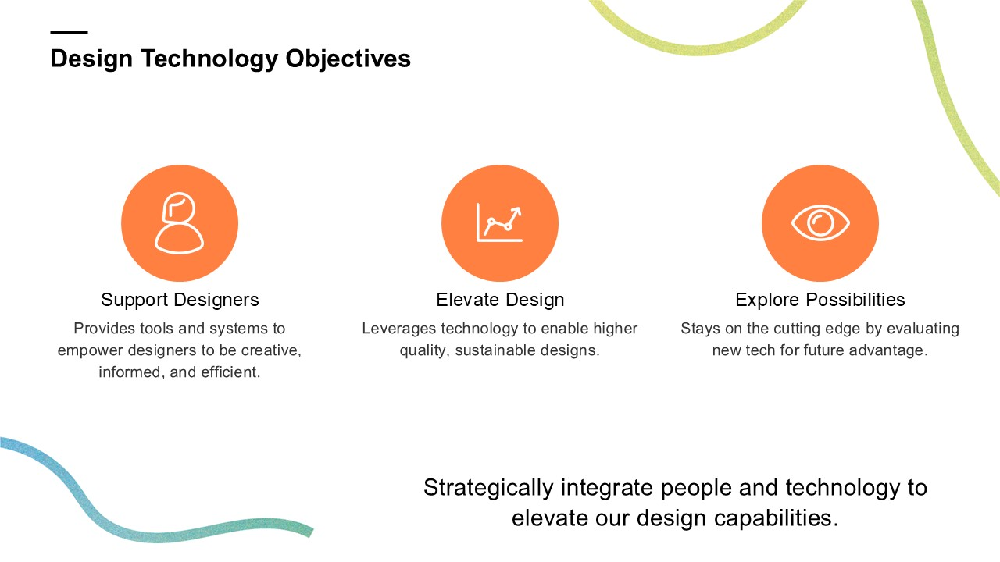
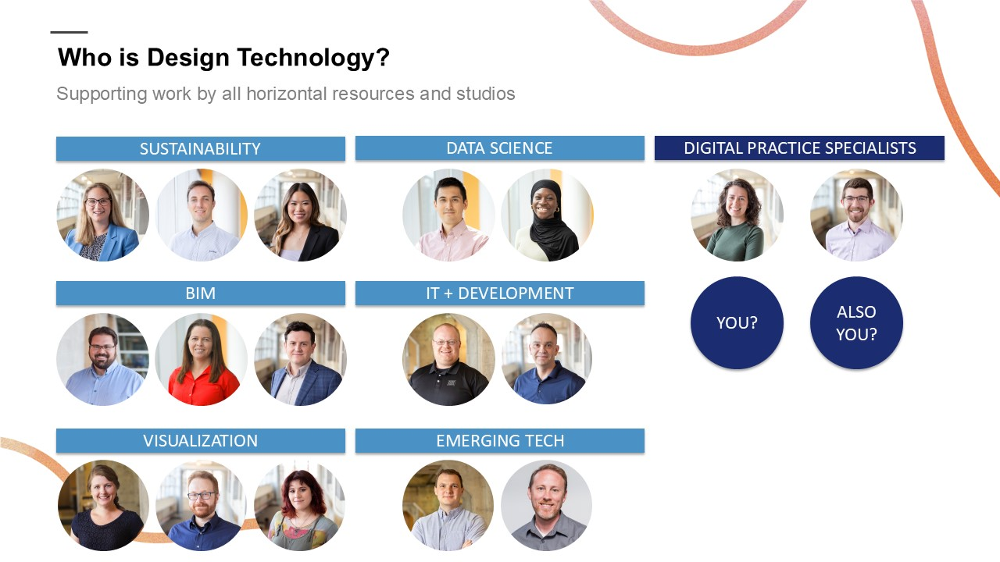
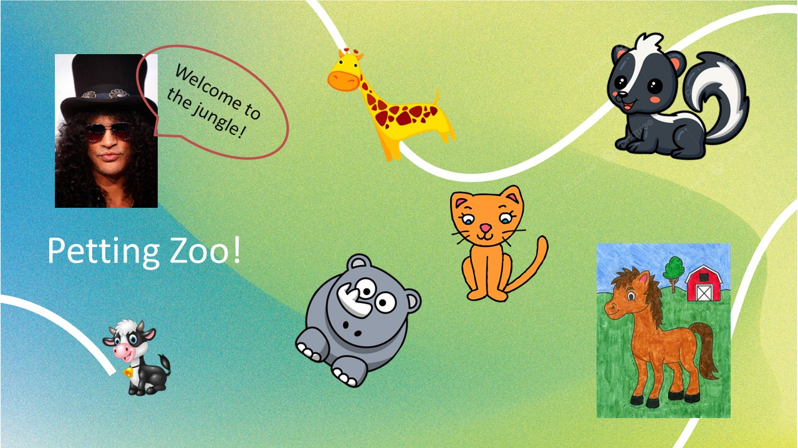
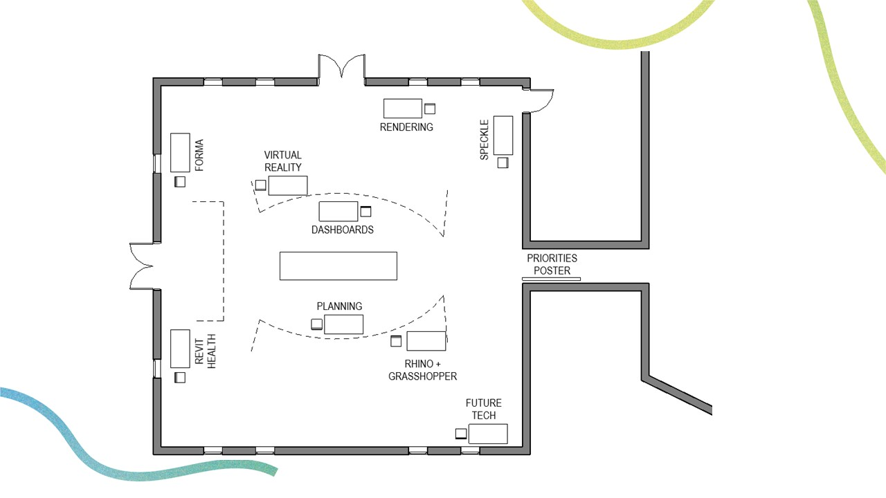
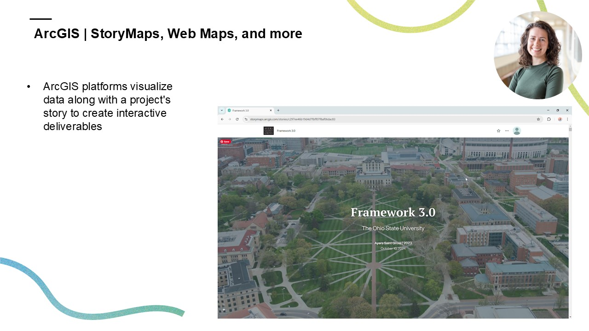
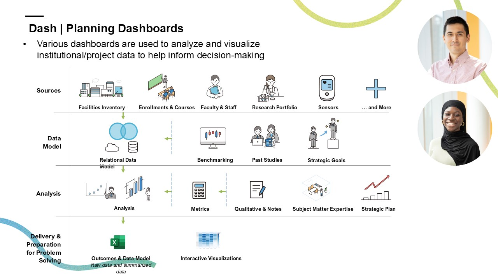
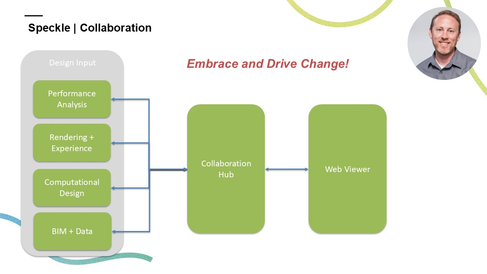
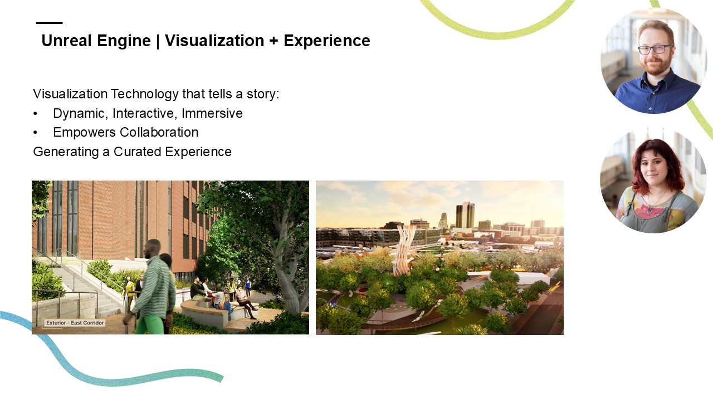

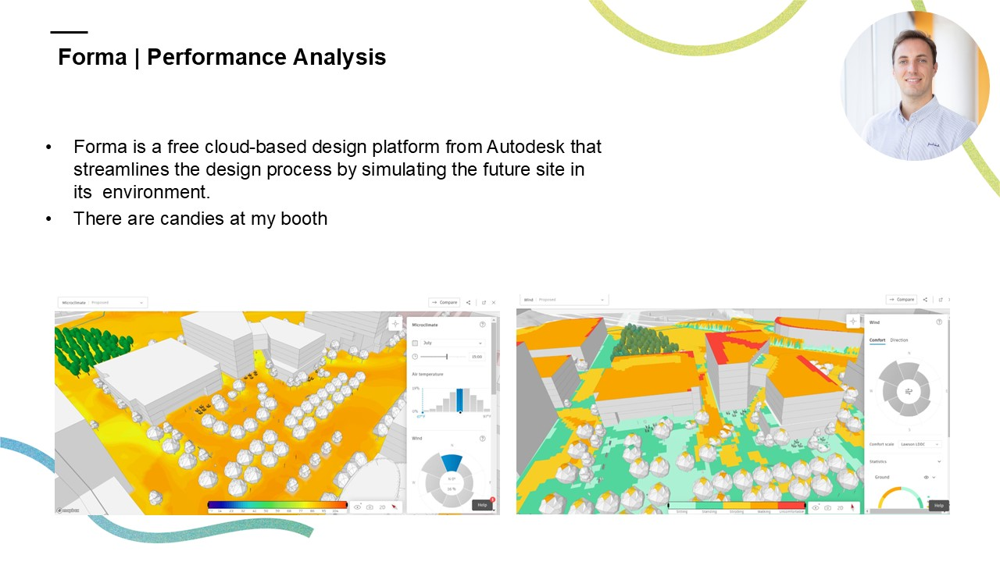
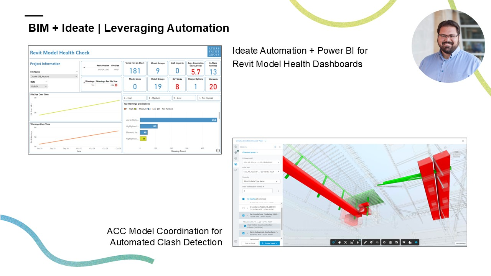
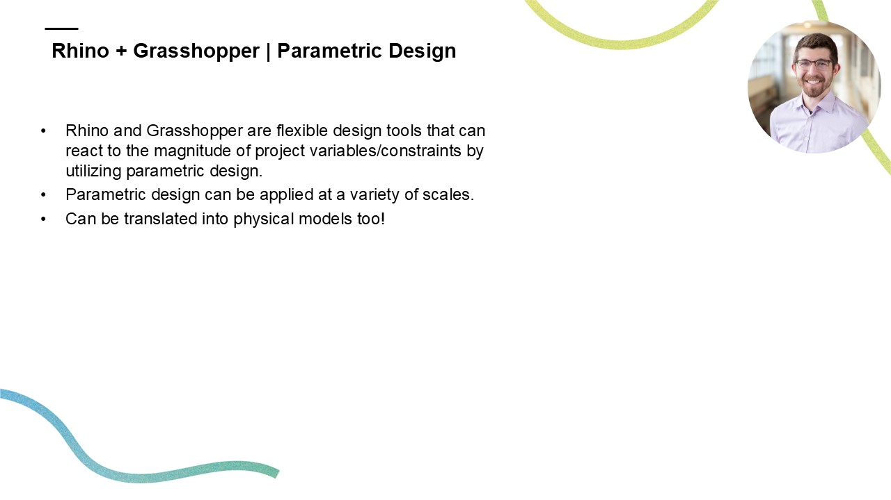
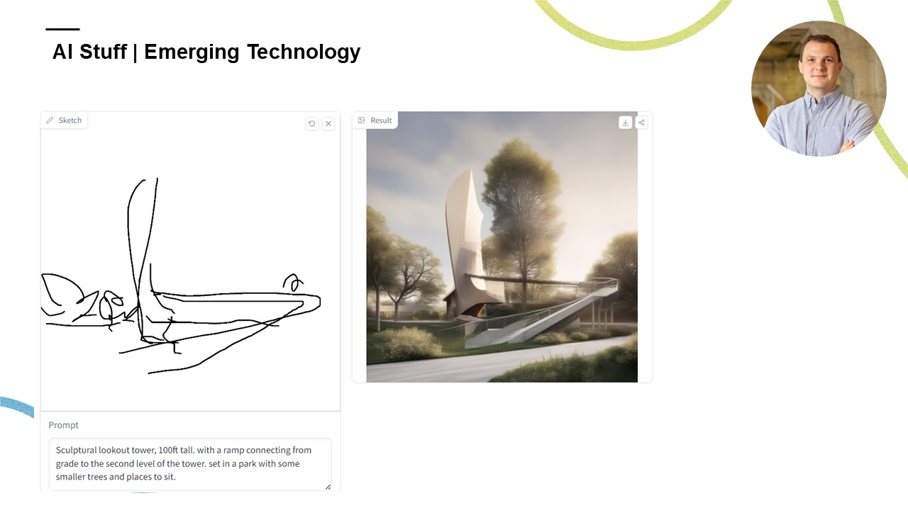
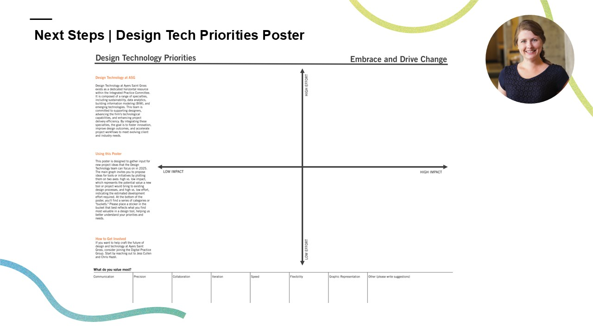

## The Result

